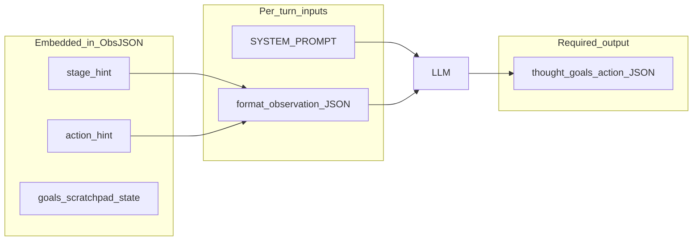

# Agent agency initiative

This document supports a long-term goal: **give match LLMs as much strategic agency as practical** while keeping the game mechanically sound. It inventories what models see each turn, ranks the most **directive** (“training wheel”) layers, and outlines a phased path to a more sandbox-style experience—**descriptive** game arc and goals, fewer **prescriptive** playbooks.

**Companion:** the forensic pipeline walk-through is [AGENT_TURN_ANATOMY.md](AGENT_TURN_ANATOMY.md). Regenerate concrete artifacts anytime with:

```bash
python scripts/dump_turn_anatomy.py
```

Outputs land in [`docs/agent_turn/`](agent_turn/).

---

## Executive summary

| Non-negotiable (keep) | Negotiable (candidate to relax) |
|------------------------|----------------------------------|
| Valid JSON reply matching the engine’s expected envelope (`thought`, `scratchpad_update`, `goals`, `action`) | Long worked examples and step-by-step “day 1” scripts in the system prompt |
| `action.kind` ∈ engine-supported verbs; args satisfy preconditions | “You MUST / REQUIRED” goal-discipline copy |
| Warp targets ∈ `sector.warps_out`; failures visible in `recent_events` / `recent_failures` | Hard-coded economic playbooks (haggle %, “sweet spot” trading advice) |
| Win conditions communicated clearly | Auto arc stages (S1–S5) that tell the model *what to do next* |
| Enough observation fields to reason without hallucinating map/port state | Per-turn hint lines that *command* loadouts (e.g. buy N fighters) vs. surfacing *legality* |

**Principle:** separate **contract** (schema, verbs, legality) from **coaching** (narrative scripts). Agency increases when coaching shrinks or becomes explicitly optional/advisory.

---

## Per-turn input map (match agents — AI-vs-AI / LLM slots)

End-to-end: `build_observation` → `format_observation` → `LLMAgent.act` → provider API → `_parse_response` → `apply_action`.

| Role | Source | Stability | Purpose |
|------|--------|-----------|---------|
| **system** | [`src/tw2k/agents/prompts.py`](../src/tw2k/agents/prompts.py) — `SYSTEM_PROMPT` | Constant per deploy (~hundreds of lines) | Identity, win rules, output schema, encyclopedic mechanics, worked examples, diplomacy/combat/corp copy |
| **user** | Same file — `format_observation(obs)` → JSON string | Every tick | Ground truth state: self, sector, map memory, logs, **embedded** `stage_hint` and `action_hint` |

Provider wiring (temperature, max tokens, timeouts) lives in [`src/tw2k/agents/llm.py`](../src/tw2k/agents/llm.py). The **user message is only** `format_observation` output; there is no separate hidden user preamble.

### Pipeline diagram



---

## User JSON: top-level keys shipped to the LLM

From [`format_observation`](../src/tw2k/agents/prompts.py) (order in payload is dict insertion order in current Python):

- **Tick / match:** `day`, `tick`, `max_days`
- **Self:** `self` — id, name, credits, net_worth, alignment, rank, experience, turns, ship blob, corp, planet_landed, alive, deaths, max_deaths
- **Arc overlay:** `stage_hint` — object from `stage_hint(obs)` (S1–S5 or ELIMINATED)
- **Agent memory (engine-persisted):** `goals`, `scratchpad`
- **Local situation:** `sector`, `adjacent`
- **Strategic objects:** `owned_planets`, `other_players`, `rivals`, `orphaned_planets`, `alliances`, `corp`
- **Comms:** `inbox` (last 10)
- **Intel:** `known_ports_top` (subset), `known_warps` (full observed graph)
- **Economy:** `trade_log` (last 25), `trade_summary`
- **Feedback:** `recent_failures`, `recent_events` (last 30)
- **Coaching strip:** `action_hint` (prose built in [`observation.py`](../src/tw2k/engine/observation.py) — `_action_hint`)

### Observation superset vs LLM visibility

The pydantic `Observation` model can hold fields that **`format_observation` does not include**. If the system prompt mentions a field that is not in this list, the model cannot see it. A recent dump reported **on `Observation` but not in the user JSON:** `finished`, `limpets_owned`, `probe_log` (verify after engine changes).

---

## Baseline sizes (regenerate to refresh)

Last run: `python scripts/dump_turn_anatomy.py` (heuristic sim to **day 1, tick 160**, player **P1**).

| Artifact | Path | Size (bytes) | Notes |
|----------|------|----------------|-------|
| System prompt dump | [`docs/agent_turn/system_prompt.md`](agent_turn/system_prompt.md) | ~23,800 | Verbatim `SYSTEM_PROMPT`; dominates token budget |
| User message | [`docs/agent_turn/user_message.json`](agent_turn/user_message.json) | ~14,300 | Pretty-printed on disk |
| **Measured** user string | *(script stdout)* | **10,539 chars** | ~**2,634** tokens (÷4 heuristic) |
| Action hint strip | [`docs/agent_turn/action_hint.txt`](agent_turn/action_hint.txt) | ~1,560 | Extracted for readability |
| Stage hint | [`docs/agent_turn/stage_hint.json`](agent_turn/stage_hint.json) | ~200 | S1–S5 JSON |
| Raw observation | [`docs/agent_turn/observation_raw.json`](agent_turn/observation_raw.json) | ~16,100 | Superset vs user JSON |

The older “~14 KB / ~3,500 tokens system, ~5 KB user” figures in [AGENT_TURN_ANATOMY.md](AGENT_TURN_ANATOMY.md) should be **replaced mentally** with the table above after regeneration—the system prompt has grown.

---

## Required model output (contract)

Parsed in [`_parse_response`](../src/tw2k/agents/llm.py). Single JSON object, no markdown fences. Conceptually:

- `thought` — short rationale (spectator-facing via events)
- `scratchpad_update` — persisted private notes
- `goals` — `{ short, medium, long }` with omit-to-keep / empty-string-to-clear semantics
- `action` — `{ kind, args }` — one engine verb

This envelope is **not** optional today: the runner and persistence assume goals/scratchpad fields for continuity. Making them optional would be an **engine/parser change**, not prompt-only.

---

## Directive heat map — top offenders

Ranked by how much they **script** behavior vs **enable** choice.

| Rank | Layer | Location | Why it’s “training wheels” | If relaxed |
|------|-------|----------|----------------------------|------------|
| 1 | **Mega `SYSTEM_PROMPT`** | [`prompts.py`](../src/tw2k/agents/prompts.py) | Scripted A→E progression; long mechanics treatise; **multi-turn Day-1 worked example with gold JSON**; aggressive haggling prescriptions; repeated imperative goal rules (“REQUIRED”, “#1 way commanders stall”) | Lower token cost; more diverse openings; risk more invalid trades / waits until model adapts |
| 2 | **`stage_hint`** | [`stage_hint()`](../src/tw2k/agents/prompts.py) | Hard **S1–S5** labels and `next_milestone` strings that tell the player what to do next based on net worth / citadel / day heuristics | Model chooses its own phase labels; risk losing a cheap “am I early or endgame?” anchor |
| 3 | **`_action_hint`** | [`observation.py`](../src/tw2k/engine/observation.py) | Lists legal verbs; **post-death re-arm** text with concrete fighter thresholds and StarDock prices; LLM timeout recovery; P&L lines; **trailing** competitive nudges when rivals lead | Fewer “do X before Y” lines; keep pure legality + repeated-failure warnings longer |
| 4 | **Goals + scratchpad in I/O** | Prompt + parser | Useful for memory, but **three-horizon goals** act as a commitment device that shapes every turn’s planning style | Softer wording or optional horizons (needs code) |
| 5 | **Summaries baked into observation** | `trade_summary`, `recent_failures` | Helpful anti-loop devices; slightly opinionated roll-ups | Could be reduced to raw logs (higher cognitive load on the model) |

### Copilot vs match agent (scope)

These are **different** LLM surfaces; do not merge audits blindly.

| Surface | System prompt | User payload |
|---------|---------------|--------------|
| **Match LLM** | `SYSTEM_PROMPT` in [`prompts.py`](../src/tw2k/agents/prompts.py) | Full `format_observation` JSON |
| **Chat copilot** | [`chat_agent.py`](../src/tw2k/copilot/chat_agent.py) — compact tool-envelope rules | `_compact_observation` (~1–2 KB) + tool catalog |
| **Task autopilot** | [`TASK_SYSTEM_PROMPT`](../src/tw2k/copilot/task_agent.py) | Observation + task context; includes preferred strategies for `profit_loop` |

Agency work on **spectator match** agents should focus on `prompts.py` + `observation.py`. Copilot prompts are already relatively small and task-scoped.

---

## What to keep when “removing wheels”

1. **Victory definition** — economic (e.g. credit threshold), elimination, time net worth — in **short** form.
2. **Strategic north star** — “typical TW2002 arc” as **descriptive** background (trade → upgrade → colony → citadel → power projection), not a mandatory checklist.
3. **Action vocabulary** — complete list of verbs or a pointer to a stable doc; invalid kinds must stay impossible to execute.
4. **Feedback loops** — `recent_events`, `recent_failures`, and legal warp lists are **state**, not coaching; they increase agency by making the world legible.
5. **Tooling hooks** — scratchpad / goals / future memory tools: consider **lighter** prompts (“use if helpful”) rather than deleting persistence.

---

## Phased roadmap (future execution — not done here)

| Tier | Focus | Example actions |
|------|--------|-----------------|
| **0 — Measure** | Before/after | Token counts (`dump_turn_anatomy`), parse-error rate, `WAIT` streaks, heuristic fallback rate in saves’ `events.jsonl` |
| **1 — Compress system** | Move encyclopedia + worked example to `docs/` or optional RAG/tool; keep tight contract + win + schema + pointer to observation keys | Largest win for agency per token |
| **2 — Soften `stage_hint`** | Rename to advisory; add env flag e.g. `TW2K_ARC_HINTS=0|1`; or emit only `stage` without `next_milestone` | Reduces phased “rules” |
| **3 — Trim `_action_hint`** | Levels: `full` vs `minimal` (legality + repeated failures only); drop imperative loadout lines where possible | Less hand-holding after deaths |
| **4 — Parser / schema** | Optional goals fields, shorter scratchpad cap — **requires code + tests** | Align contract with “softer” prompting |

---

## Risks and guardrails

- **Parse errors** — shorter prompts can increase malformed JSON; monitor `[parse error]` thoughts.
- **Heuristic fallback** — after repeated timeouts/errors, [`LLMAgent`](../src/tw2k/agents/llm.py) delegates to `HeuristicAgent`; matches look “fast” and template-like. Watch `agent_error` and timeout events.
- **Silent mismatch** — if the system prompt references fields not in `format_observation`, models invent or confuse; run a periodic **prompt vs payload** audit (the dump script prints fields only on `Observation`).

---

## Open questions

1. Should **`goals.short/medium/long`** remain mandatory in the JSON schema, or become optional with engine defaults?
2. Should **haggling tactics** live in the system prompt at all, or only in a player-facing wiki?
3. Should **`stage_hint`** be **off by default** for “expert” matches once metrics look good?
4. Do we want a **single** `TW2K_HINT_LEVEL=full|minimal` that toggles both `stage_hint` richness and `_action_hint` coaching?

---

## Concrete suggestions (summary)

1. **Biggest agency win:** shorten `SYSTEM_PROMPT` by moving the **worked example** and **encyclopedia** (StarDock price sheet, full colonize numbered list, multi-planet essay) into reference docs; keep a **tight** system message: who you are, how you win, output JSON shape, “read observation keys,” “on failure read `recent_events` / `recent_failures`.”
2. **Second:** make `stage_hint` explicitly **non-authoritative** in text, or gate it behind an env flag.
3. **Third:** in `_action_hint`, separate **legality** (what you *can* do now) from **strategy** (what you *should* buy); keep legality longer, shorten imperatives.

---

## Document history

- **2026-04-23** — Initial `AGENCY_INITIATIVE.md` from the Agent agency initiative plan; baseline sizes from `dump_turn_anatomy.py` run on the same date.
- **2026-04-23** — Tier 0–3 execution: `TW2K_HINT_LEVEL=full|minimal`, slim `_MATCH_PROMPT_MINIMAL` + `docs/PLAYBOOK.md`, `stage_hint` drops `next_milestone` in minimal, `_action_hint` omits strategy coaching in minimal, `match_metrics` event + `scripts/summarize_match.py`, server banner shows hint level.
